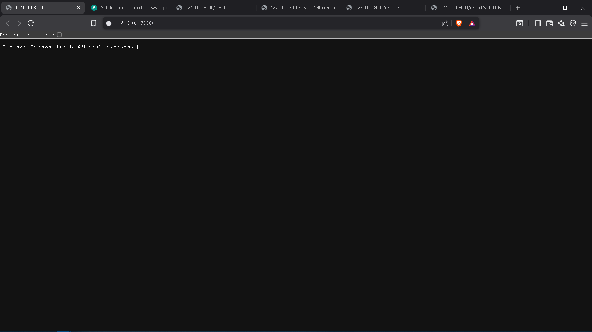
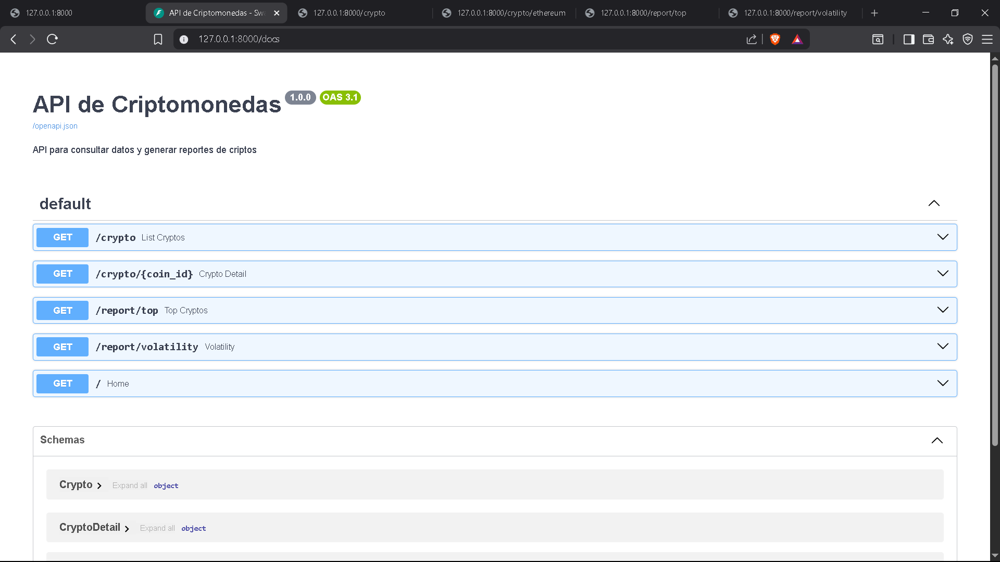
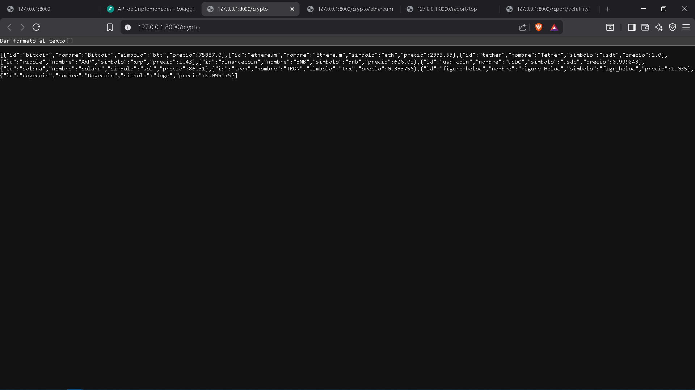
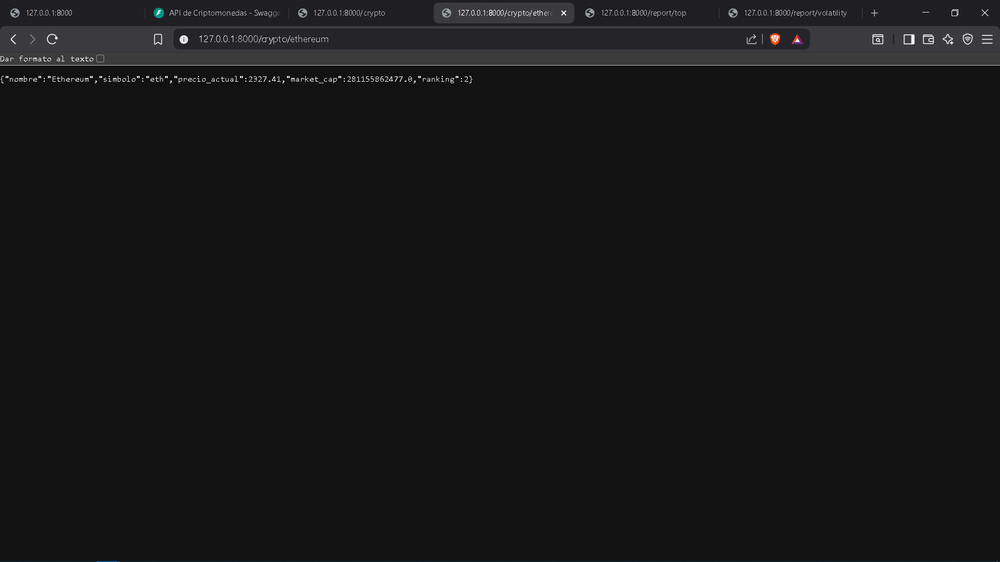
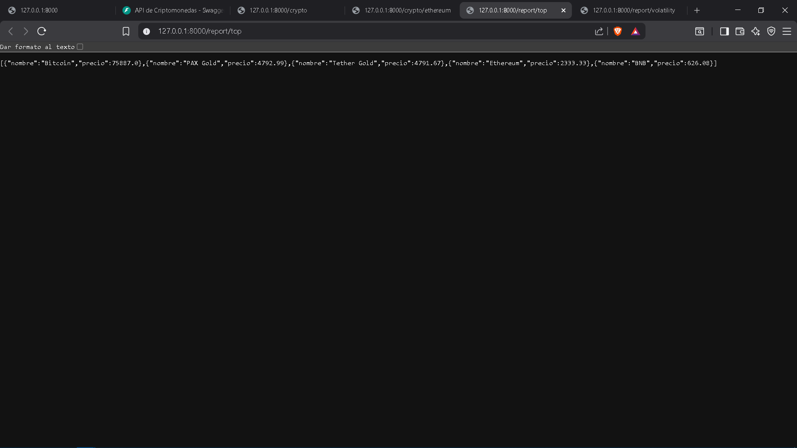
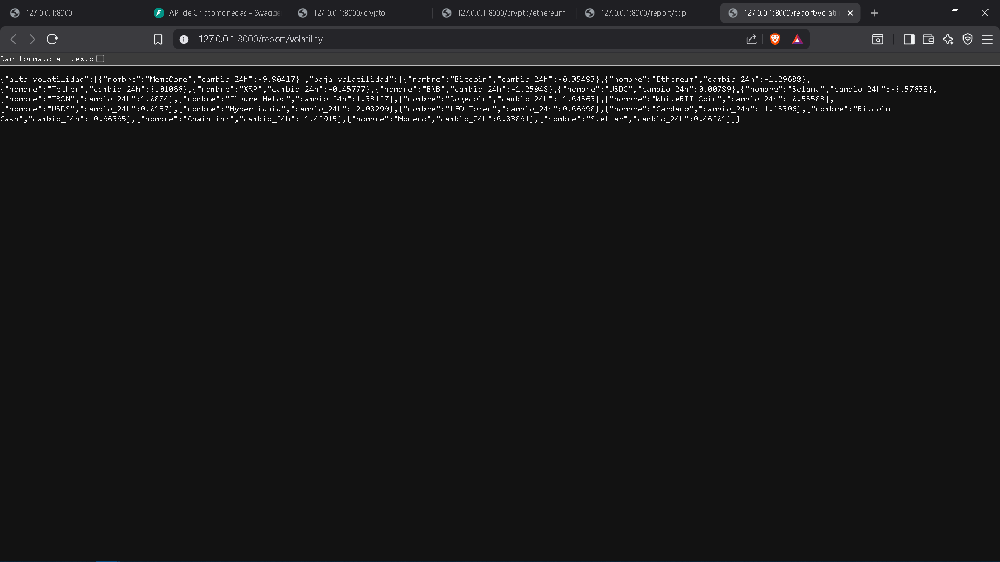

# API de Criptomonedas
API desarrollada con **FastAPI** para consultar y analizar datos de criptomonedas utilizando la API pública de CoinGecko.

## Objetivo
Diseñar, construir y desplegar un API funcional aplicando buenas prácticas de desarrollo, versionamiento y consumo de APIs externas.

## Tecnologías utilizadas
Python 3
FastAPI
Uvicorn
Requests
Pydantic

## Instalación
1. Clonar el repositorio:
    git clone https://github.com/TU_USUARIO/api-crypto.git
    cd api-crypto

2. Crear entorno virtual en Windows (opcional pero recomendado):
    venv\Scripts\activate

3. Instalar dependencias:
    pip install -r requirements.txt

## Ejecución del proyecto
uvicorn app.main:app --reload

## Endpoints (Ejecución en ambiente local)
Servidor disponible en: http://127.0.0.1:8000  
FastAPI genera documentación automática: http://127.0.0.1:8000/docs

### **GET /**  
Retorna un mensaje de bienvenida de la API.

### **GET /crypto**  
Obtiene una lista de las principales criptomonedas con información básica como nombre, símbolo y precio.

### **GET /crypto/{coin_id}**  
Obtiene información detallada de una criptomoneda específica utilizando su identificador (por ejemplo: bitcoin, ethereum).

### **GET /report/top**  
Retorna las criptomonedas con mayor precio dentro del listado consultado.

### **GET /report/volatility**  
Clasifica las criptomonedas según su variación en las últimas 24 horas en dos grupos: alta volatilidad y baja volatilidad.

## Evidencias
  
  
  
  
  
